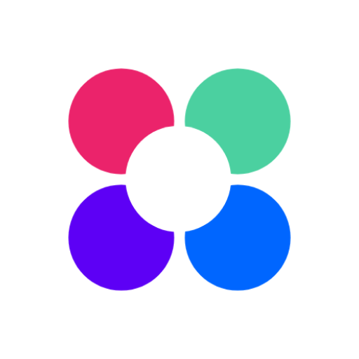

# Дипломное задание "NeWork" (Профессия Android Developer)

## Легенда

В рамках дипломного проекта вам необходимо разработать приложение, чем-то напоминающее формат LinkedIn.

В приложении пользователи могут создавать посты с медиаресурсами и геометками, но ключевое — позиции, где работал пользователь, его социальные связи (в каких постах он отмечен, в каких конференциях является спикером, а где - участником), тематические посты, чекины на конференциях, фото с экспертом (в посте упоминается эксперт), ссылки на YouTube и т.д.

Всё API, которое предоставляет сервер, с примерами вызовов описано в файле [requests.http](server/src/test/resources/requests.http).

**Важно**: привыкайте к работе в реальных командах - чаще всего вам дадут примеры запросов и не дадут такого "развёрнутого" описания, как на Vk, GitHub и других платформах.

Если всё-таки файла с запросами не хватает

Основная идея: есть посты, события и пользователи (вместе с их работами).

Ключевое - пользователи. Получая список пользователей (мы для простоты сделали это одним запросом), вы можете затем его отображать на любые поля, в которых фигурируют id пользователей:
* упоминания
* "лайкеры"
* спикеры 
* участники

А далее - обычный CRUD:
* общая лента постов (`/api/posts`), из которой по id автора можно перейти на его стену (`/api/{authorId}/wall`), а оттуда на его "работы" (`/api/{userId}/jobs`)
* лента событий (`/api/events`)

Ключевое: не поленитесь, почитайте как обрабатывать ссылки в приложении, чтобы можно было кликая по ссылке переходить в ваше же приложение на определённый фрагмент.

И помните: в случае возникновения вопросов, вы всегда их можете задать в канале Slack.

## Задача

**Ваша ключевая задача** - разработать полностью функционирующее приложение, самостоятельно выбрав, какую часть функциональности вы реализуете (можно реализовывать не всё).

**Задача разложена на 3 этапа:**
1. Планирование.
2. Непосредственно выполнение работы.
3. Сдача работы.

**Важно**: вы сами решаете, какие функции приложения реализовать. Мы лишь требуем, чтобы в обязательном порядке было:
1. Регистрация/аутентификация
1. CRUD для следующих типов сущностей: посты, события, работы
1. "Проигрывание" медиа-вложений (для изображений - показ, для аудио и видео - воспроизведение)
1. Переход по внешним ссылкам (поля `link`, если ссылаются на внешние ресурсы)   
1. Использование Push Notifications

Если какой-то функциональности вам будет не хватать, можете обратиться к руководителю курса по вопросам её добавления.

### Планирование

После начала работы над дипломом в течение 3 рабочих дней вы должны сдать руководителю план работ, в котором описано:

* какие функции будет реализовывать ваше приложение;
* какие инструменты вы будете использовать (библиотеки и т.д.);
* интервальная оценка затрат на реализацию с учётом рисков (в часах);
* план сдачи работ (когда будут выполнены работы и будет готова итоговая версия приложения).

**Важно**: руководитель выступает в роли представителя по стороны Заказчика, поэтому именно он определяет правила выполнения и сдачи работ. Ему же вы можете задавать вопросы по поводу того, как реализовать ту или иную функциональность. И он же определяет, правильно вы её реализовали или нет. Любые вопросы, которые не освещены в данном документе, стоит уточнять у руководителя. Если его требования/указания расходятся с указанными в данном документе, то приоритет имеют требования/указания руководителя.

### Выполнение работ

На этом этапе вы непосредственно выполняете работу. При этом вы можете консультироваться с руководителем по поводу вопросов, требующих уточнения.

### Сдача работы

Прикладываете ссылку и скриншоты (можно видео) ключевых моментов работы, чтобы руководителю не приходилось с нуля заполнять приложение данными.

## Критерии сдачи

1. Выполнены минимальные требования к работе
1. Приложение полностью функционирует (нет логически недоделанных частей, заглушек, `TODO` и т.д.) 
1. Нет явных изъянов в архитектуре, "плохо пахнущего кода", нигде не едет вёрстка, противоречий с Design Guidelines, используются современные инструменты и библиотеки

## Как правильно задавать вопросы дипломному руководителю?

Что поможет решить большинство частых проблем:

1. Попробовать найти ответ сначала самостоятельно в интернете или в материалах курса и только после этого спрашивать у дипломного руководителя. Скилл поиска ответов пригодится вам в профессиональной деятельности.
1. Если вопросов больше одного, то присылайте их в виде нумерованного списка. Так дипломному руководителю будет проще отвечать на каждый из них. 
1. При необходимости прикрепите к вопросу скриншоты и стрелочкой покажите, где не получается. Программу для этого можно скачать здесь [https://app.prntscr.com/ru/](https://app.prntscr.com/ru/)

Что может стать источником проблем:

1. Вопросы вида «Ничего не работает. Не запускается. Всё сломалось». Дипломный руководитель не сможет ответить на такой вопрос без дополнительных уточнений. Цените своё время и время других.
2. Откладывание выполнения курсового проекта на последний момент.
3. Ожидание моментального ответа на свой вопрос. Дипломные руководители - работающие разработчики, которые занимаются, кроме преподавания, своими проектами. Их время ограничено, поэтому постарайтесь задавать правильные вопросы, чтобы получать быстрые ответы :)
